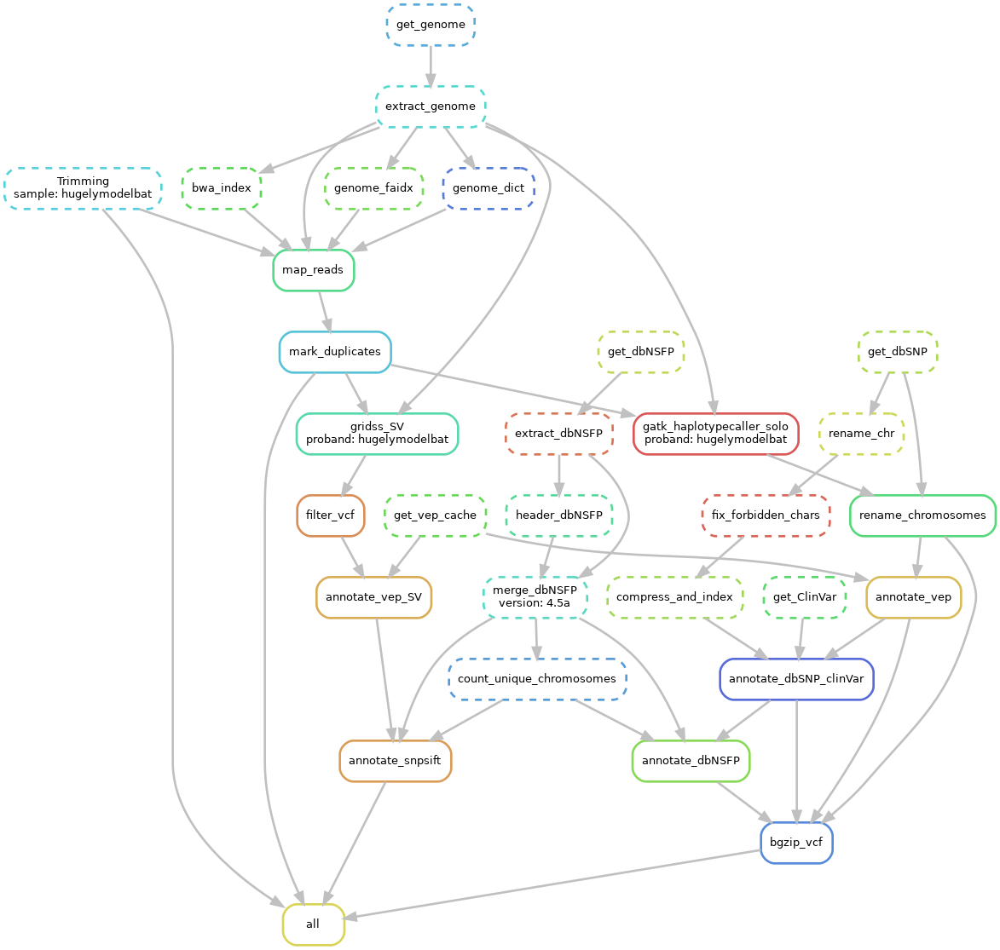
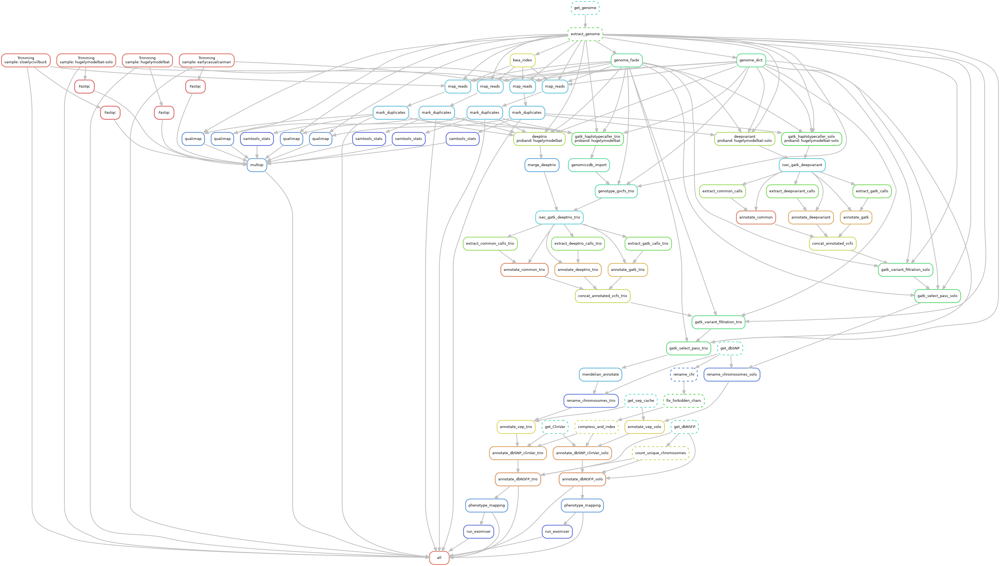

# SyncBio-gDNA

SyncBio-gDNA is simple and ready to use variant discovery pipeline to discover rare disease variants from exome sequencing data. It streamlines the process of analyzing genomic data by leveraging **Snakemake**, a robust workflow management system.

---

## Quick Installation
1. Clone this repository:
   ```bash
   git clone
   ```
2. Navigate to the repository:
   ```bash
   cd syncbio-gdna
   ```
3. Ensure you have a Linux environment (Ubuntu or Ubuntu-like 22.04 LTS distro is recommended).
4. Install [Docker](https://docs.docker.com/engine/install/ubuntu/) and [Anaconda](https://docs.conda.io/projects/conda/en/latest/user-guide/install/linux.html).

---

## Usage

### 1. Run the Pipeline
To run the pipeline, use the following commands:

#### **Solo Analysis**
- **Single Proband Sample**:
   ```bash
   ./syncbio-gdna run --fq1 <path/to/fastq1> --fq2 <path/to/fastq2> --output <path/to/results>
   ```

- **Multiple Proband Samples**:
   Use a `samplesheet.csv` file to specify multiple proband samples:
   ```bash
   ./syncbio-gdna run --samplesheet <path/to/samplesheet.csv> --output <path/to/results>
   ```

#### **Trio Analysis**
- **For Proband, Mother, and Father Samples**:
   Use a `samplesheet.csv` file to specify multiple samples:
   ```bash
   ./syncbio-gdna run --samplesheet <path/to/samplesheet.csv> --output <path/to/results>
   ```


### 2. Unlock the Working Directory
If the pipeline is interrupted or locked, unlock it using:
```bash
./syncbio-gdna unlock
```

### 3. Help Options
To view all available options and commands, use:
```bash
./syncbio-gdna --help
```

---
## Samplesheet Example

Below is an example of a `samplesheet.csv` file used for trio analysis (test data). Replace the `fq1`, `fq2`, and/or `bam` paths with actual paths to your data files.
For solo analysis, provide only the proband sample with the relation field set to "proband".

```csv
case_id,sample,relation,platform,sex,phenotype,fq1,fq2,bam
justhusky,earlycasualcaiman,father,illumina,1,1,trio_test_data/earlycasualcaiman_1.fastq.gz,trio_test_data/earlycasualcaiman_2.fastq.gz,
justhusky,slowlycivilbuck,mother,illumina,2,1,trio_test_data/slowlycivilbuck_1.fastq.gz,trio_test_data/slowlycivilbuck_2.fastq.gz,
justhusky,hugelymodelbat,proband,illumina,1,2,trio_test_data/hugelymodelbat_1.fastq.gz,trio_test_data/hugelymodelbat_2.fastq.gz,

```

## Workflow DAGs

### Trio Analysis 


### Solo Analysis


### Solo and Trio Analysis


